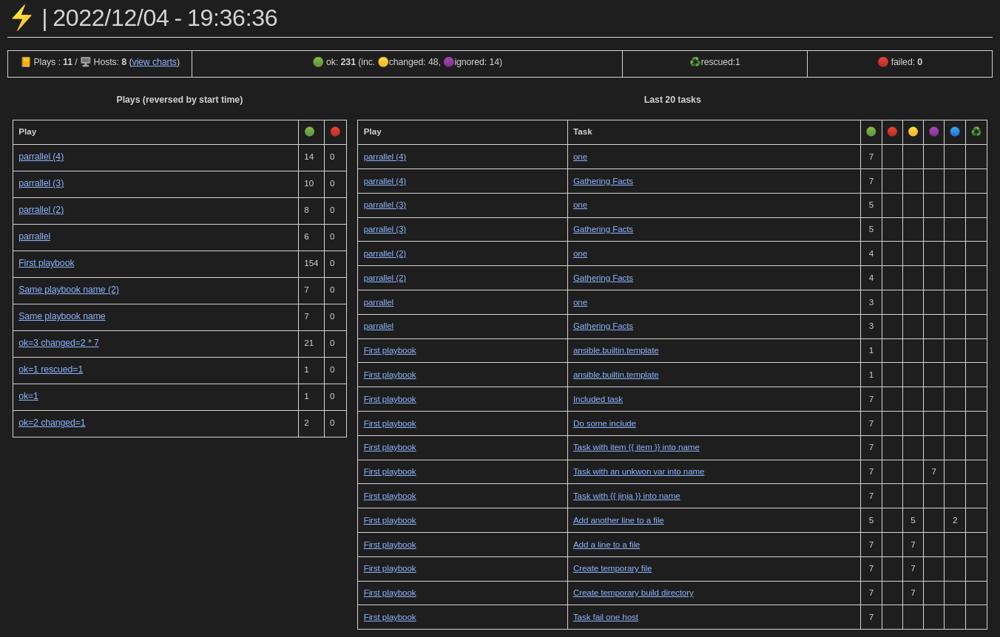
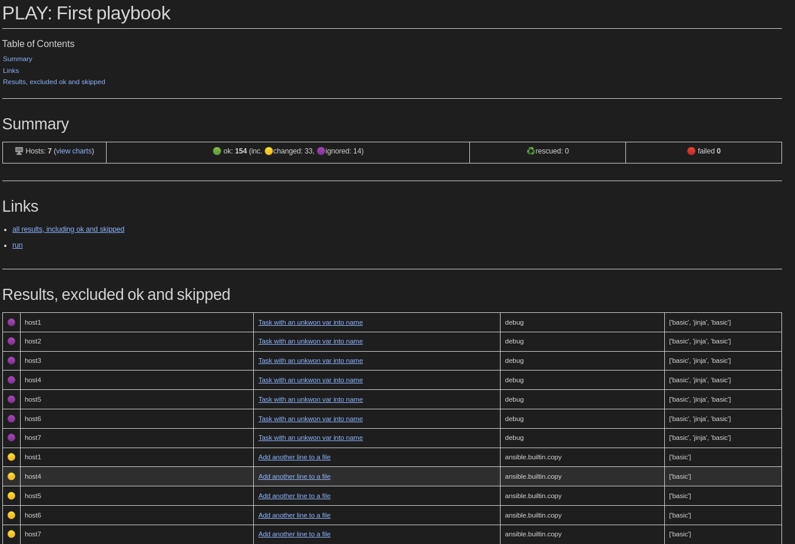

= Caradoc

:doctype: article
:description: Caradoc for Ansible creates Reports as asciidoc files
:license-type: MIT
:author: The Caradoc team
:repository-url: https://github.com/jseguillon/caradoc
:source-highlighter: rouge
:icons: font
:toc:

ifdef::env-github[]
:rouge-style: github
:tip-caption: :bulb:
:note-caption: :information_source:
:important-caption: :heavy_exclamation_mark:
:caution-caption: :fire:
:warning-caption: :warning:
endif::[]

== About the Project

Records Ansible as Asciidoc files. Uses kroki/vegalite for charts. Best rendered with:

* VsCode AsciiDoctor extension ** version 3.0.1 **
* Chromium AsciiDoctor extension
* AsciiDoctor CLI

Requires Ansible>=3 and python>=3.7.

[cols="~a,~a,~a"]
|====
| Run
[#run,link=docs/run.png]

| Playbook
[#playbook,link=docs/playbook.png]

| Result
[#task,link=docs/task.png]

|====

== Install

Download and place in default callback directory:

-------
mkdir -p ~/.ansible/plugins/callback
cd ~/.ansible/plugins/callback
curl -SL -O https://raw.githubusercontent.com/jseguillon/caradoc/main/plugins/callback/caradoc.py
-------

Or donwload somewhere else and add to callback path:

-------
ANSIBLE_CALLBACK_PLUGINS=/[path]/plugins/callback ansible-playbook -i tests/hosts tests/testplay.yml
-------

Run any ansible playbook and look at localy created `.caradoc` directory.

=== Start kroki to get charts

-------
docker run -d  -p8000:8000 yuzutech/kroki
-------

=== Dark mode

You can define asciidoc attribute `caradoc-theme` to `dark` to get better highlight.js and vegalite charts render.

In vscode settings:
-------
"asciidoc.preview.asciidoctorAttributes": {
  "caradoc-theme": "dark"
}
-------

== Change Log
See link:CHANGELOG.adoc[CHANGELOG].

== License
Distributed under the {license-type} License. See `LICENSE` for more information.

== Contact
{author}

Project Link: {repository-url}

